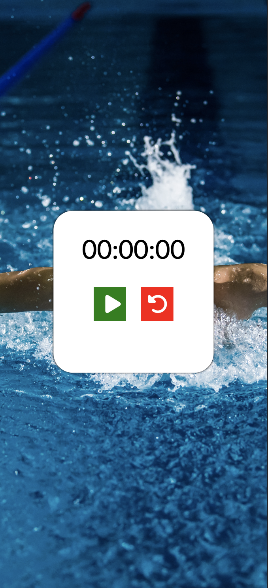

# Code Lab/ FreeCodeCamp - Stop Watch

This is a code along of the FreeCodeCamp/Code Lab YouTube tutorial on basic DOM manipulation with vanilla JS.

## Table of contents
- [Code Lab/ FreeCodeCamp - Stop Watch](#code-lab-freecodecamp---stop-watch)
  - [Table of contents](#table-of-contents)
  - [Overview](#overview)
    - [The challenge](#the-challenge)
    - [Screenshot](#screenshot)
    - [Links](#links)
  - [My process](#my-process)
    - [Built with](#built-with)
    - [Useful resources](#useful-resources)
  - [Author](#author)
  - [Acknowledgments](#acknowledgments)

## Overview

### The challenge

Users should be able to:

- View the optimal layout for the component depending on their device's screen size
- See 

### Screenshot

### Links

- Solution URL: [Github](https://github.com/mariabrock/code-lab-to-do-list)
- Live Site URL: [Github Pages](https://mariabrock.github.io/code-lab-to-do-list/)

## My process

### Built with

- Semantic HTML5 markup
- CSS custom properties
- Flexbox
- CSS Grid
- Mobile-first workflow
- vanilla Javascript

### Useful resources

 - [Code Lab YT Video, Part 1](https://www.youtube.com/watch?v=P7NgFfIaWgU&ab_channel=CodeLab)
 - [Code Lab YT Video, Part 2](https://www.youtube.com/watch?v=Aru6eM9VYKo&ab_channel=CodeLab)
 - [FreeCodeCamp YT Video](https://www.youtube.com/watch?v=5fb2aPlgoys&ab_channel=freeCodeCamp.org)

## Author

- Github - [@mariabrock](https://github.com/mariabrock)
- LinkedIn - [@mariabrock](https://www.linkedin.com/in/maria-brock/)

## Acknowledgments